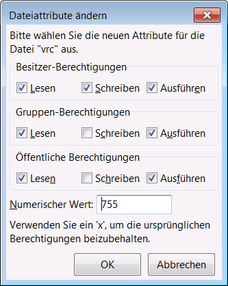

#VRC Monitor

crontab task will call periodicaly a linux script with performs a python script (vrc.py). thispython scripts raeds the log-files on µSDcard and copies relevant data into a new textfile. Afterwards this textfile will be transfered to a ftp-repository on an web server 

## Crontab service
... to be added

Folder: /etc/crontabs
File: root
Content:
```C++
0 23 * * * /usr/bin/vrc

```

###Crontab Syntax
> Jeder Cronjob hat folgendes Format:
> * * * * * auszuführender Befehl
>  ┬ ┬ ┬ ┬ ┬
>  │ │ │ │ │
>  │ │ │ │ └──── Wochentag (0-7, Sonntag ist 0 oder 7)
>  │ │ │ └────── Monat (1-12)
>  │ │ └──────── Tag (1-31)
>  │ └────────── Stunde (0-23)
>  └──────────── Minute (0-59)
> Ein Stern * bedeutet Ausführung wird immer erfolgen, also zu jeder Minute, jeder Stunde, jedem Tag, jedem Monat oder jedem 
> Wochentag. 


##Linux script

```script
# /usr/bin
# 2014-11-14 creaion
# 2015-02-19 copy result to 'txt' folder on local sd-card
pwd
cd /mnt/sda1/arduino/www/vrc
#
dateOfLogfile=$(date +%Y-%m-%d)
echo $dateOfLogfile
#
#
filename="vrc_"$dateOfLogfile".log"
textfile="txt/vrc_"$dateOfLogfile".txt"
echo $filename
#
python vrc.py $filename
#
cp vrc2008day.txt txt/vrc2008day.txt
cp vrc2008day.txt $textfile
echo $textfile
# 
```

Atributes of \`vrc\`needs to be changed to execute (chmod 755) or via FileZilla (see picture)



##Python

recommended Python version 2.7.6.1

The both python scripts 
* vrc.py
* vrc2ftp.py

needs to be located in folder /mnt/sda1/arduino/www/vrc

Evaluated data will be stored in /txt/vrc_YYYY-MM-DD.log and into
file vrc2008day.txt for the ftp transfer to the outside web service repository.
